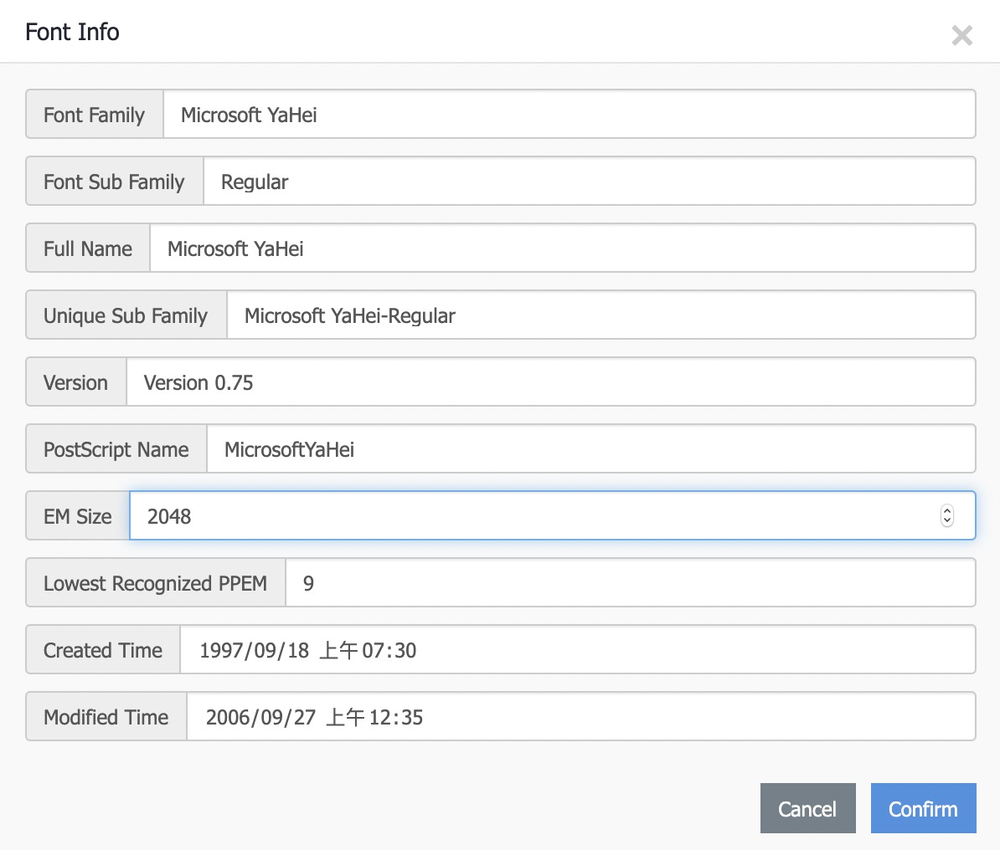
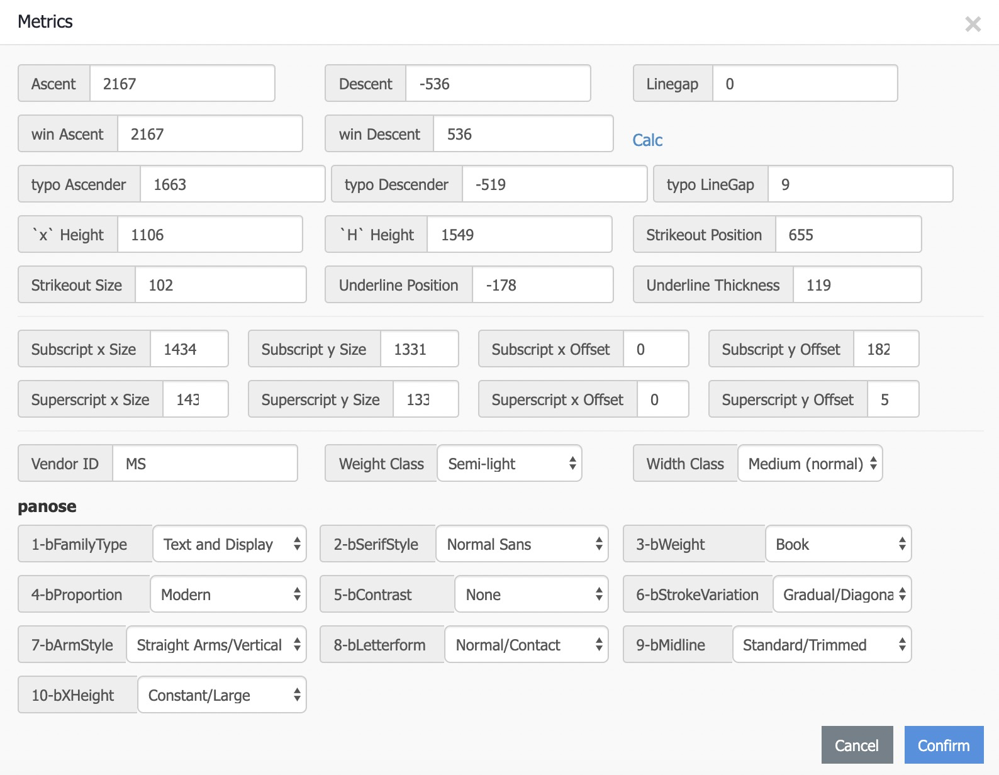

最近在折腾 Canvas 中的文字排版，是个大坑。我们都知道 Canvas 提供 `textBaseline` 特性使我们能够调整文本的基线位置，它的默认值是 `alphabetic`，与 CSS 中的默认基线位置是一致的，那么在同样的 x 与 y 下，为什么 DOM 的结果与 Canvas 的结果不一致呢？这次就来看看这个问题。

先明确一个点，`fillText(text, x, y)` API 中的参数 `y` 指的是 baseline 的位置，因此 DOM 与 Canvas 的结果不一致。那么要使它们的结果一致，这个 y 的值应该是多少呢？这就得说到字体度量。这是一张字体度量的例子：


这张图解释了为什么 `fillText` 的 `y` 为 0 时，我们只能看到文字的底部，因为这时候文字的底部就是图中的「Descent」部分。那么我们要使它排版正确，只需要将文字往下移动 「Ascent」距离就行了。在 fontForge 中我们可以获取到一个字体的度量信息：


也可以使用在线的 [百度字体编辑器](http://fontstore.baidu.com/static/editor/index-en.html) 查看，非常方便。

我们以微软雅黑为例，在百度字体编辑器中打开后，它的字体信息与度量如下：





可以看到微软雅黑的「Ascent」为 2167，它是相对于「EM Size」的值，所以绝对值需要除以「EM Size」。计算之后得到的是当字号为 1px 时的「Ascent」,所以再乘上字号即可得到相应的值。

于是我们使用这个「Ascent」，将文字往下移，大功告成。

不过我们还少了对 lineHeight 的考虑。回到上文的「Ascent」部分，在 DOM 中，「Ascent」与「Descent」组成的部分就是文本实际的内容区域。


文本的内容区域与行高区域的关系如下图：


当我们增大 lineHeight 时，它会在文字的上下两侧平均增加相应的距离，我们称之为 leading。除此之外，还需要考虑字体度量中 lineGap 的影响，lineGap 在排版中的影响也是平均作用在文字上下两侧。

于是，我们只要计算出文本的行高区域就行了，虚拟区域只需要 `fontSize * lineHeight` 即可。

于是，最后的计算就变成了：

``` javascript
function getTextTop(fontSize, lineHeight, fontMetrics) {
    const { ascent, descent, emSize, lineGap } = fontMetrics
    const absoluteAscent = ascent / emSize * fontSize
    const absoluteLineGap = lineGap / emSize * fontSize
    const contentAreaHeight = (ascent + Math.abs(descent)) / emSize * fontSize
    const virtualAreaHeight = fontSize * lineHeight
    const leading = (virtualAreaHeight - contentAreaHeight) / 2
    const textTop = leading + absoluteLineGap / 2 + absoluteAscent

    return textTop
}
```

就此，已经能够基本完成文本在 Canvas 中的简单排版了，虽然只是排版系统中的一小步，但是这一步总算是迈了出去。

## 参考

- [Deep dive CSS: font metrics, line-height and vertical-align](http://iamvdo.me/en/blog/css-font-metrics-line-height-and-vertical-align)